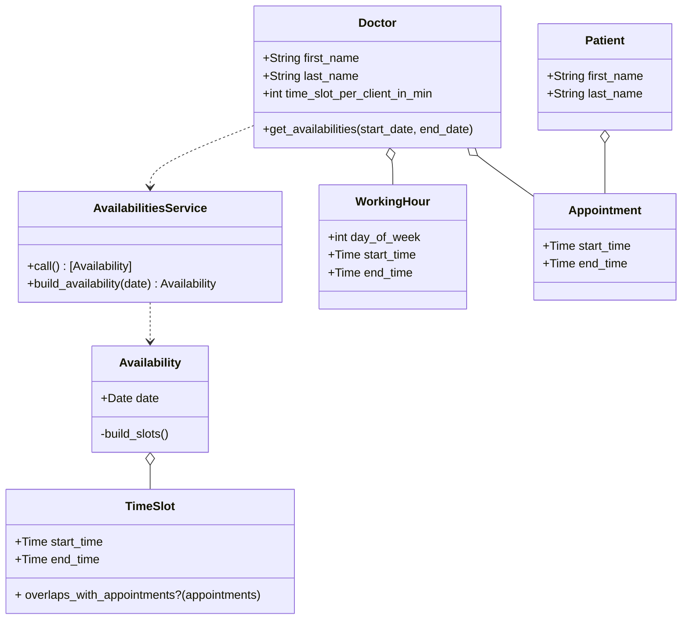

# Health Appointment API
The Health Appointment API is a RESTful API designed to manage appointments for health professionals and patients. It allows users to schedule, update, and cancel appointments.

## Documentation

### OpenAPI
You can find the OpenAPI specification of the implemented endpoints in `doc/openapi.yaml`.  
You can render it by clicking the [following link](https://editor.swagger.io/?raw=http://raw.githubusercontent.com/leobz/health_appointment_api/main/doc/openapi.yaml).  
Run `OPENAPI=1 bundle exec rspec` if you want to regenerate the `doc/openapi.yaml` file.

### Simplified Class Diagram


## Issue Tracking
For completed tasks, please refer to [this link](https://github.com/leobz/health_appointment_api/issues?q=is%3Aissue+is%3Aclosed).  
For pending tasks that are yet to be implemented, please visit the [open issues](https://github.com/leobz/health_appointment_api/issues?q=is%3Aopen+is%3Aissue).

## Installation
To install the Health Appointment API on your local machine, follow these steps:

Clone the repository:
```bash
git clone https://github.com/leobz/health_appointment_api.git
```

Install dependencies:
```bash
cd health_appointment_api
bundle install
```

Set up the database:
```bash
rails db:create db:migrate
```

Start the server:
```bash
rails server
```

## Run tests
```bash
rspec spec
```

## Gems

| Gem                                                                  | Description                                      | Usage         |
|----------------------------------------------------------------------|--------------------------------------------------|---------------|
| [Blueprinter](https://github.com/procore-oss/blueprinter)            | JSON Object Presenter for Ruby                   | Serialization |
| [Rspec Rails](https://github.com/rspec/rspec-rails)                  | Testing library                                  | Testing       |
| [Factory Bot Rails](https://github.com/thoughtbot/factory_bot_rails) | Setting up Ruby objects as test data             | Testing       |
| [Rspec OpenAPI](https://github.com/exoego/rspec-openapi)             | Generate OpenAPI schema from RSpec request specs | Documentation |
